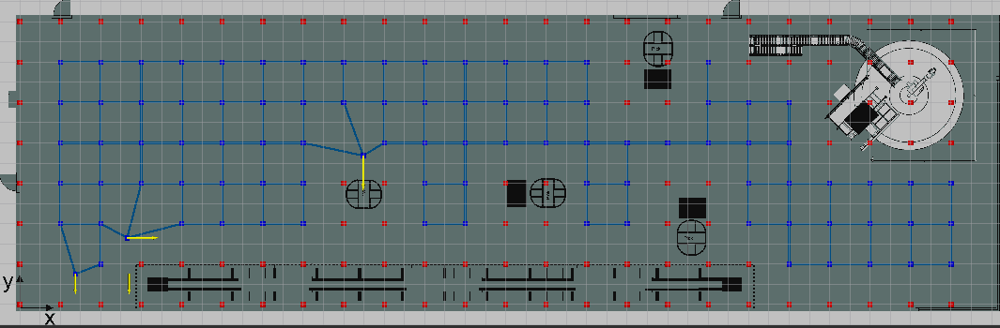

# Start Guide

Before starting the SP module follow the [Install guide](./install/install.md).

<!--
 and [API Walkthrough](./user/api.md) procedures.
-->

In the following, two start options will be described, depending if you installed the source from the docker containers or from scratch.


## <a name="fromdocker">Starting from Docker - Central SP</a>

Go to the folder where you put your [docker-compose.yml](./install/install.md#dockercompose) file and type:
```
xhost local:root (call this only once - this is for display)
sudo docker-compose up
```
You should see the entities in, e.g. firefox, at the address <http://localhost:1026/v2/entities>.

This docker container starts the creation of topology (nodes, edges) from the given map file, and with included annotations from the annotation file. As a default, IML lab will be started with 4 annotations, and with the default 2 m cell size, as is the case in this example:



To use arbitrary annotations file and map file you should create these files and put it in the same folder next to the docker-compose.yml and uncomment the lines containing these files. These example files can be found in the folder test/docker_compose_files/Central_SP_docker.

Here is a quick guide how to create these files:

* To use arbitrary annotations create the **annotations.ini** file:
```
#annotations.ini
[P1]
# coordinates
point_x = 18.4
point_y = 6.5
theta = 180
distance = 1.8
```
where **point_x**, **point_y** are coordinates of the annotation, and **theta** and **distance** determine where the topology node should be so that Task Planner can use this node as the goal distanced (1.8 m in this example) from the annotation and oriented towards the annotation so that AGV has heading of **theta** (180 degrees in this example) with respect to the positive x-axis.

* Uncomment the line in the [docker-compose.yml](./install/install.md#dockercompose):
```
            - ./annotations.ini:/root/catkin_ws/src/mod.sw.sp/src/maptogridmap/launch/annotations.ini:ro
```
After restarting docker-compose.yml, i.e., type:
```
sudo docker-compose up
```
the result should be as in this figure:


* To use arbitrary map file you should prepare **map.png** (export as png in any graphical software) and **map.yaml**. Here is an example of the CHEMI factory floorplan saved as png file:


It should be a greyscaled image, where dark grey will be considered as obstacle, while light grey as free area.

* To set the dimensions of the map file you need to prepare parameter file **map.yaml**, where you need to set the **resolution** of the map, and thresholds for defining what will be considered as an obstacle, and what as a free area. Here is an example for the CHEMI factory:
```
image: map.png
resolution: 0.12
origin: [0.0, 0.0, 0.0]
negate: 0
occupied_thresh: 0.165
free_thresh: 0.001
```
Here, the line ```image: map.png``` should not be ever changed since, on the docker side, the name **map.png** will always be used, while the file names can be arbitrary since they are copied to the **map.png** and **map.yaml**. The parameter ```resolution: 0.12``` means the size of the pixel of the png file is 0.12 m wide. To calculate the **resolution**, you need to know the width of the image in meters. Then, simply divide the width of the image with the number of pixels. Adjust the parameters **occupied_thresh** and **free_thresh** to different values, depending on which shade of grey should be considered as occupied. In this example, thresholds are quite low, which means almost only white is considered as a free area.

* Uncomment the lines in the [docker-compose.yml](./install/install.md#dockercompose):
```
            - ./map.yaml:/root/catkin_ws/src/mod.sw.sp/src/maptogridmap/launch/map.yaml:ro
            - ./map.png:/root/catkin_ws/src/mod.sw.sp/src/maptogridmap/launch/map.png:ro
```
After restarting docker-compose.yml this is what should be the result:


It can be seen that here the topology nodes are too rare and we are missing some of them in narrow passages. In the following we will change the size of the grid cell so that we do not miss topology nodes in the passages between the racks. In this example map the passage is 2.5 m wide, which means the size of the cell size should be half of it to include the worst case of the alignment of passages with the grid.
 
* To change the size of the grid cell for calculating the topology prepare **topology.launch** as follows:
```
<launch>
<node name="map_server" pkg="map_server" type="map_server" args="$(find maptogridmap)/launch/map.yaml" respawn="false" >
<param name="frame_id" value="/map" />
</node>
<node name="rviz" pkg="rviz" type="rviz" args="-d $(find maptogridmap)/singlerobot.rviz" /> 
<node name="map2gm" pkg="maptogridmap" type="map2gm" output="screen">
        <param name="cell_size" type="double" value="1.25" />
        <param name="annotation_file" textfile="$(find maptogridmap)/launch/annotations.ini" />
</node>
    <!-- Run FIROS -->
    <node name="firos" pkg="firos" type="core.py" />
</launch>
```
where we put the parameter **cell_size** to 1.25 m.

* Uncomment the line in the [docker-compose.yml](./install/install.md#dockercompose):
```
            - ./topology.launch:/root/catkin_ws/src/mod.sw.sp/src/maptogridmap/launch/topology.launch:ro
```
After restarting docker-compose.yml this is what should be the result:


## <a name="fromdockerlocal">Starting from Docker - Local SP</a>

will come later...

## <a name="fromscratch">Starting from Scratch</a>

In this quick guide, everything will be started on the same computer where you installed ROS and this source code. For advanced configuration of starting at different computers check [Interfaces](./user/interfaces.md).

* First, start the Stage simulator with the loaded example map and one AGV inside the map (red) and one box as the unknown obstacle (green):

```
terminal 1: roslaunch lam_simulator AndaOmnidriveamcltestZagrebdemo.launch
```
The result should be the started rviz and the Stage simulator as presented here:


The green dots are simulated laser readings, and the red arrow is the localized AGV.

* Then, start the module for creating the topic for Pose with Covariance of the AGV:
```
terminal 2: roslaunch sensing_and_perception send_posewithcovariance.launch 
```
You can type 'rostopic echo' to see the message of pose with covariance:
```
rostopic echo /robot_0/pose_channel
```
You can start some other simulation example following [this guide.](./user/api.md#poswithcov)
You can also prepare your own simulation following [the guide for preparing the map.](./user/api.md#preparingmap)

* Start the calculation of local map updates that the AGV sees as new obstacles which are not mapped in the initial map.
```
terminal 3: roslaunch mapupdates startmapupdates.launch
```
You can check the topic of local map updates by typing: 
```
rostopic echo /robot_0/newObstacles
```
You can change the resolution of the local map updates by following the guide in Section [Map updates](./user/api.md#mapupdates).

All previous steps can be replaced by calling a single launch file for the Local SP:
```
roslaunch sensing_and_perception local_robot.launch 
```
This launch file starts the localization, local map updates and module for publishing Pose with Covariance.

* To merge the local map updates into a global gridmap and topology, launch the maptogridmap:
```
terminal 4: roslaunch maptogridmap startmaptogridmap.launch
```
You can change the resolution of the global gridmap and topology (the distance between the nodes) by checking the Section [Topology](./users/api.md#topology). There you can also find about annotations and how to change theirs parameters.

Now, you can reproduce the figures from [Home](./index.md#mapupdates1) by moving the green box in front of the AGV (use the left click of the mouse and hold it while dragging the box around).

 

